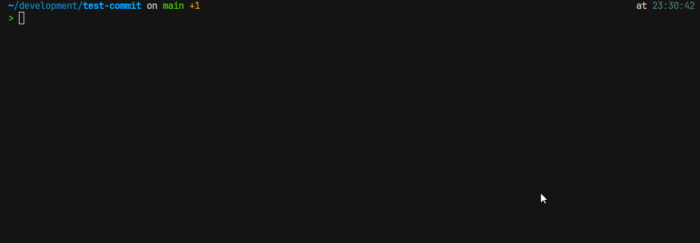

# Git Hook AI Commit Reviewer

A Git hook that uses AI to review and validate commit messages. By default, it checks if messages follow Conventional Commits best practices, but you can completely customize the validation criteria through the system prompt.

## Usage

The hook will run automatically when you attempt to make a commit. It will:

1. Analyze the commit message
2. Provide feedback on message quality
3. Suggest improvements if necessary
4. Allow you to proceed or cancel the commit



## Requirements

- Git
- Bash
- `make`
- `curl`
- `jq`
- OpenAI API key

## Configuration

The hook can be configured through the following environment variables:

- `COMMIT_REVIEWER_API_KEY`: Your OpenAI API key (required)
- `COMMIT_REVIEWER_API_URL`: OpenAI API URL (default: "<https://api.openai.com/v1/chat/completions>")
- `COMMIT_REVIEWER_RESPONSE_LANGUAGE`: Language for AI responses (default: "en")
- `COMMIT_REVIEWER_COMMIT_LANGUAGE`: Language for Commits (default: "en")
- `COMMIT_REVIEWER_SKIP_AMEND`: Whether to skip validation on amend commits (default: "true")
- `COMMIT_REVIEWER_SKIP_WIP`: Whether to skip validation on commits containing "wip" or "WIP" (default: "true")
- `COMMIT_REVIEWER_LOG_LEVEL`: Log level (debug, info, error) (default: "info")

## Installation

1. Clone this repository:

```bash
git clone git@github.com:Tsugami/git-hook-ia-commit-reviewer.git ~/.git-hook-ia-reviewer
```

2. Run the installation command:

```bash
cd ~/.git-hook-ia-reviewer && make install
```

3. Configure your OpenAI API key:

```bash
echo 'export COMMIT_REVIEWER_API_KEY="your-api-key"' >> ~/.bashrc
echo 'export COMMIT_REVIEWER_LANGUAGE="en"' >> ~/.zshrc  # optional, for English responses
source ~/.bashrc
```

## Uninstallation

To remove the hook, run:

```bash
cd ~/.git-hook-ia-reviewer && make uninstall
```

## Troubleshooting

To enable debug mode and see detailed logs:

```bash
export COMMIT_REVIEWER_LOG_LEVEL=debug
```

## Contributing

Contributions are welcome! Please feel free to open an issue or submit a pull request.

## License

This project is licensed under the MIT License - see the [LICENSE](/LICENSE) file for details.
